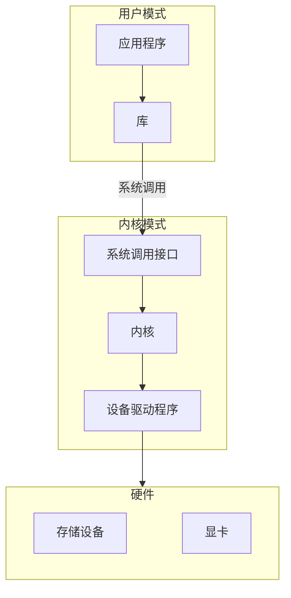

# 操作系统
是一种软件，与计算机硬件进行通信，并为程序执行提供环境。抽象了底层硬件的细节，使开发人员能专注于软件逻辑，而不是特定硬件。

## 操作系统分类
主流操作系统有两个：类UNIX和Windows。

| 操作系统 | 系列 | 说明 |
| --- | --- | --- |
| Ubuntu | 类UNIX | 基于GNU/Linux |
| Android | 类UNIX | 基于Linux内核 |
| iOS | 类UNIX | 基于Darwin |
| macOS | 类UNIX | 基于Darwin |
| Windows 10 | Windows | 基于Windows NT |

## 用户模式和内核模式
* 进程：运行程序的实例，每个进程有唯一的进程ID和独立的虚拟地址空间。进程可以在用户模式和内核模式之间切换，在用户模式下运行应用程序代码时不能直接访问硬件，需通过系统调用切换到内核模式才能执行特权操作。不同进程之间的内存地址空间相互隔离。
* 库：导出各种API函数被程序使用。一些函数只是立即进行内核系统调用的包装器；一些函数是库文件自身所含的用户模式代码中完全实现的；一些介于两者之间。
* 内核：操作系统的核心，用于管理系统。
* 设备驱动程序：与硬件设备交互，并为该硬件提供编程接口。
* 系统调用：操作系统的编程接口，为用户模式代码提供了一种请求特权内核模式操作的机制。
* 虚拟内存地址：每个进程都有独立的虚拟地址空间，分为用户空间和内核空间两部分。用户空间存储进程自己的代码和数据，不同进程的用户空间相互隔离；内核空间在所有进程间共享，存储操作系统内核代码和数据。进程在用户模式下只能访问用户空间，切换到内核模式后才能访问内核空间。

## 参考资料
1. [Linux和GNU系统](https://www.gnu.org/gnu/linux-and-gnu.html)
2. [用户模式和内核模式](https://learn.microsoft.com/zh-cn/windows-hardware/drivers/gettingstarted/user-mode-and-kernel-mode)
3. 《计算机是如何工作的》——第十章